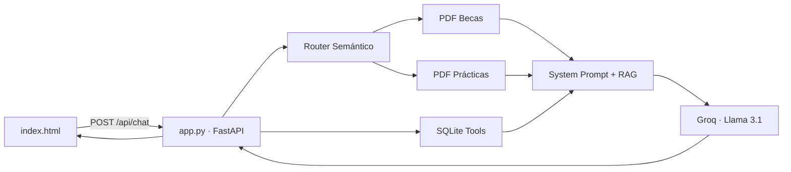

# Chatbot Universitario Multi-RAG

> Asistente virtual institucional para consultas sobre **Becas y Apoyo Estudiantil** y **Prácticas Profesionales y Titulación**, con validación de matrícula y respuestas basadas en reglamentos oficiales.

<p align="center">
  <a href="https://www.python.org/"></a>
  <a href="https://fastapi.tiangolo.com/"></a>
  <a href="https://www.sqlite.org/"></a>
  <a href="https://groq.com/"></a>
  <a href="https://developer.mozilla.org/es/docs/Web/HTML"></a>
  <a href="https://github.com/pgodoy1980/proyecto_ipvg"></a>
</p>

<p align="center">
  <a href="https://github.com/pgodoy1980/proyecto_ipvg"></a>
</p>

---

## Descripción

Plataforma local tipo chat que permite a los estudiantes:

- Consultar el **Reglamento de Becas y Apoyo Estudiantil**
- Consultar el **Reglamento de Prácticas Profesionales y Titulación**
- Validar su estado académico ingresando su **número de matrícula**

El sistema combina **RAG** (Recuperación Aumentada por Generación) sobre documentos PDF con **datos relacionales en SQLite**, entregando respuestas contextualizadas y personalizadas mediante un LLM de Groq.

---

## Arquitectura



**Flujo de procesamiento**

1. El frontend envía matrícula y mensaje al endpoint `POST /api/chat`
2. Se consultan datos del alumno y su avance curricular en SQLite
3. Un router semántico (LLM) selecciona el PDF relevante
4. Se extrae texto del documento con marcadores por página
5. Se construye un *system prompt* con contexto RAG + datos del estudiante
6. Groq genera la respuesta en español con formato Markdown

---

## Características

| Característica | Descripción |
|---|---|
| **Multi-RAG** | Enrutamiento automático entre reglamento de becas y de prácticas/titulación |
| **Citas por página** | Extracción PDF con marcadores `INICIO/FIN PÁGINA` para referencias fidedignas |
| **Tools SQLite** | Historial académico, decil socioeconómico y cálculo de avance curricular |
| **Regla del 80%** | Validación automática del requisito mínimo para prácticas profesionales |
| **Prompt estricto** | Respuestas formales, personalizadas y en Markdown; sin alucinaciones |
| **UI moderna** | Chat responsive con burbujas, avatares e indicador de escritura |

---

## Stack tecnológico

### Backend

| Tecnología | Uso |
|---|---|
| **FastAPI** | API HTTP y endpoint `/api/chat` |
| **Uvicorn** | Servidor ASGI |
| **Pydantic** | Validación de entrada (`numero_matricula`, `mensaje`) |
| **Groq SDK** | Inferencia con modelo `llama-3.1-8b-instant` |
| **pypdf** | Extracción de texto desde PDFs |
| **python-dotenv** | Gestión de credenciales en `.env` |
| **SQLite3** | Base de datos local del estudiante |

### Frontend

| Tecnología | Uso |
|---|---|
| **HTML / CSS / JavaScript** | Interfaz del chat |
| **css/chat.css** | Estilos propios con diseño moderno |
| **Google Fonts (Inter)** | Tipografía institucional |

---

## Estructura del proyecto

```
proyectofinal/
├── app.py                                      # Backend FastAPI
├── index.html                                  # Frontend del chat
├── css/chat.css                                # Estilos de la interfaz
├── init_db.py                                  # Inicialización de SQLite
├── base_conocimiento_becas.pdf                 # Reglamento de becas
├── base_conocimiento_practica_titulacion.pdf   # Reglamento de prácticas
├── requerimientos.txt                          # Dependencias Python
├── INSTRUCCIONES.txt                           # Guía de despliegue
├── README.md                                   # Este archivo
└── .env                                        # Clave GROQ_API_KEY (no versionado)
```

> El nombre del PDF de prácticas debe coincidir con la constante `PDF_PRACTICAS` en `app.py`.

---

## Instalación y ejecución

### 1. Clonar el repositorio

```bash
git clone https://github.com/pgodoy1980/proyecto_ipvg.git
cd proyecto_ipvg
```

### 2. Instalar dependencias

```bash
pip install -r requerimientos.txt
```

### 3. Configurar credenciales

Crear un archivo `.env` en la raíz del proyecto:

```env
GROQ_API_KEY=tu_clave_groq_aqui
```

### 4. Inicializar la base de datos

```bash
python init_db.py
```

### 5. Iniciar el backend

```bash
python app.py
```

### 6. Abrir la interfaz

Abrir `index.html` en el navegador.

---

## Datos de prueba

| Matrícula | Alumno | GPA | Decil | Avance | ¿Cumple 80%? |
|---|---|---|---|---|---|
| `2024001` | Juan Pérez | 5.4 | 3 | 90.0% | Sí |
| `2024002` | María López | 4.9 | 2 | 70.0% | No |

---

## API

**Endpoint:** `POST http://127.0.0.1:8000/api/chat`

**Request**

```json
{
  "numero_matricula": "2024001",
  "mensaje": "¿Cuáles son los requisitos para postular a la beca de alimentación?"
}
```

**Response**

```json
{
  "respuesta": "..."
}
```

---

## Autor

**Patricio Godoy** — [pgodoy1980/proyecto_ipvg](https://github.com/pgodoy1980/proyecto_ipvg)
